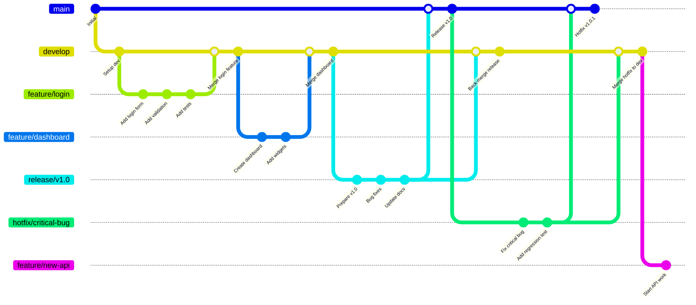

# Git Configuration

- [Setup](#setup)
- [Aliases](#aliases)
- [Workflows](#workflows)
  - [Branch Management](#branch-management)
    - [Gitflow Overview](#gitflow-overview)
    - [Keeping Feature Branches Updated](#keeping-feature-branches-updated)
  - [Module Management](#module-management)

## Setup

The [public.gitconfig](public.gitconfig) is automatically set as the global configuration in `.zshrc`. <br>
Using `git config --global` to change git configurations will edit this file. <br>

Upon installing dotfiles, the scripts need to be made executable:

```bash
chmod +x -R $HOME/dotfiles/.config/git/
```

## Aliases

- `git st` → `git status` (quick status check)
- `git co` → Uses smart-checkout.sh script (intelligent checkout with dev sync)
- `git tree` → Beautiful graph log with colors showing all branches, commits, and authors
- `git purge` → Removes local branches that have been deleted on remote (gone branches)
- `git sync` → Fetches dev, rebases current branch on dev, and purges gone branches
- `git branch-summary` → Shows files changed between current branch and origin/dev
- `git modified` → Shows files changed with their status
- `git module` → Uses subtree-modules.sh script for managing git subtrees

## Workflows

### Branch Management
Intelligent git checkout using smart-checkout.sh that ensures you're branching from an up-to-date `develop` branch. Assumes a gitflow workflow with main, develop, feature, release, and hotfix branches.

**Usage:** `git checkout -b <new-branch-name>`

**Initial Setup Workflow:**
1. When creating new branches (`-b` flag), automatically switches to `develop` first if you're not already on it
2. Fetches latest changes from origin
3. Pulls updates if local `develop` is behind remote `develop`
4. Creates your new branch from the updated `develop`

**Why this matters:** Ensures all new feature/fix branches start from the latest `develop` state, reducing merge conflicts.

#### Gitflow Overview

The diagram below shows the complete gitflow workflow including feature development, releases, and hotfixes:



**Branch types explained:**
- **main:** Production-ready code, only receives merges from release and hotfix branches
- **develop:** Integration branch where features come together, always deployable to staging
- **feature/*:** New features branched from develop, merged back when complete
- **release/*:** Preparation for production release, allows final bug fixes and documentation
- **hotfix/*:** Critical fixes branched from main, merged to both main and develop

#### Keeping Feature Branches Updated

When working on a feature branch and other developers push changes to `develop`, you need to keep your branch updated to avoid merge conflicts:

**Sync workflow when develop has new changes:**
1. **Stash your current work:** `git stash push -m "WIP: feature progress"`
2. **Switch to develop:** `git checkout develop`
3. **Pull latest changes:** `git pull origin develop`
4. **Switch back to your feature:** `git checkout feature/your-branch`
5. **Rebase your feature onto updated develop:** `git rebase develop`
6. **Pop your stashed changes:** `git stash pop`
7. **Resolve any conflicts if they arise**

**Quick command sequence:**
```bash
git stash push -m "WIP: syncing with develop"
git checkout develop && git pull origin develop
git checkout feature/your-branch
git rebase develop
git stash pop
```

**Alternative using git sync alias:**
The `git sync` alias automates the process: it fetches develop, rebases your current branch onto the updated develop (bringing develop's changes into your branch), and purges deleted remote branches.

### Module Management
Comprehensive git subtree management using subtree-modules.sh for handling external dependencies as subtrees rather than submodules.

**Key advantages of subtrees:** Unlike submodules that store links to external repositories, git subtrees download and include the actual source files directly in your working directory. This makes the code fully self-contained within your project - team members can clone and work immediately without needing access to the original external repositories. Module metadata (source URLs and names) is tracked in `modules/.modules` for use with the `git module` commands.

**Commands:**
```bash
git module add <repo-url> [--name <custom-name>]    # Add new module
git module status [module-name...]                  # Show commit status
git module pull [module-name...]                    # Pull upstream changes
git module push [module-name...]                    # Push changes upstream
git module rm <module-name...>                      # Remove modules
```

**Directory structure:** All modules are stored in `modules/<module-name>/`